# GitHub Actions Self-Hosted Runners: Traditional vs Kubernetes with Actions Runner Controller (ARC)

> A hands-on DevOps project demonstrating how to execute GitHub Actions workflows using both a traditional Self-Hosted Runner and a Kubernetes-based runner managed by Actions Runner Controller (ARC).

---

# Table of Contents

- [Overview](#overview)
- [Objectives](#objectives)
- [Project Architecture](#project-architecture)
- [CI/CD Concepts](#cicd-concepts)
- [Prerequisites](#prerequisites)
- [Project Structure](#project-structure)
- [Part 1 - Traditional Self-Hosted Runner](#part-1---traditional-self-hosted-runner)
- [Part 2 - Kubernetes + Actions Runner Controller](#part-2---kubernetes--actions-runner-controller)
- [Workflow Lifecycle](#workflow-lifecycle)
- [Architecture Comparison](#architecture-comparison)
- [Troubleshooting](#troubleshooting)
- [Best Practices](#best-practices)
- [Lessons Learned](#lessons-learned)
- [Future Improvements](#future-improvements)
- [Technologies Used](#technologies-used)

---

# Overview

GitHub Actions provides a powerful CI/CD platform that automatically executes workflows whenever events occur in a GitHub repository.

By default, GitHub executes workflows on GitHub-hosted virtual machines. Although convenient, this approach has limitations regarding customization, resource control, and execution costs for some workloads.

This project explores two alternatives:

1. **Traditional Self-Hosted Runner**
2. **Kubernetes-based Self-Hosted Runner using Actions Runner Controller (ARC)**

The project demonstrates how Kubernetes can dynamically create ephemeral GitHub runners, improving scalability, workload isolation, and infrastructure utilization.

---

# Objectives

After completing this project, you should understand:

- How GitHub Actions executes workflows
- The role of a Self-Hosted Runner
- Advantages and limitations of traditional runners
- Kubernetes fundamentals
- Actions Runner Controller (ARC)
- RunnerDeployment resources
- Dynamic runner creation
- Workflow execution lifecycle
- Scaling GitHub runners with Kubernetes

---

# CI/CD Concepts

## Continuous Integration (CI)

Continuous Integration automatically validates source code whenever developers push changes.

Typical CI tasks include:

- Build
- Unit Testing
- Static Code Analysis
- Docker Image Build

Example

```
Developer
      │
      ▼
Git Push
      │
      ▼
GitHub Actions
      │
      ▼
Build + Test
```

---

## Continuous Delivery (CD)

Continuous Delivery extends CI by preparing applications for deployment.

Typical CD tasks include:

- Build Docker images
- Push images to a registry
- Deploy to Kubernetes
- Execute integration tests

---

## GitHub Actions

GitHub Actions is GitHub's native CI/CD platform.

A workflow is defined using YAML files located in:

```

.github/workflows/

```

Example:

```yaml
name: Build

on:
  push:

jobs:

  build:

    runs-on: ubuntu-latest

    steps:

      - uses: actions/checkout@v4

      - run: echo "Hello World"
```

Whenever a matching event occurs, GitHub creates a workflow job.

The job must then be executed by a runner.

---

# Project Architecture

## Traditional Self-Hosted Runner

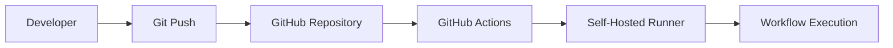

The workflow is executed directly on a machine managed by the user.

---

## Kubernetes + Actions Runner Controller

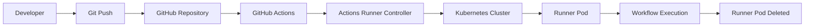

Instead of executing workflows directly on the server, Kubernetes dynamically creates runner Pods that exist only for the duration of the workflow.

---

# Prerequisites

The following environment was used during this project.

| Component | Version |
|------------|----------|
| Windows | 11 |
| WSL | Ubuntu |
| Git | Latest |
| Docker | Installed |
| Minikube | Installed |
| Kubernetes | Local Cluster |
| kubectl | Installed |
| Helm | Installed |
| GitHub Account | Required |
| GitHub Personal Access Token | Required |

---

# Project Structure

```
.
├── .github
│   └── workflows
│       └── test.yml
│
├── runner.yaml
│
└── README.md
```

- **test.yml** defines the GitHub Actions workflow.
- **runner.yaml** defines the Kubernetes RunnerDeployment managed by ARC.
- **README.md** documents the complete implementation.

---

# Understanding the Role of a Runner

GitHub Actions does not execute workflows by itself.

Instead, it creates jobs and waits for a runner to execute them.

A runner is simply a machine capable of:

- Receiving jobs from GitHub
- Downloading the repository
- Executing each workflow step
- Returning the execution result

Two runner types exist:

- GitHub-hosted runners
- Self-hosted runners

This project focuses exclusively on Self-hosted runners.
# Part 1 – Traditional Self-Hosted Runner

## What is a Self-Hosted Runner?

A Self-Hosted Runner is a machine that you own and register with GitHub to execute GitHub Actions workflows.

Unlike GitHub-hosted runners, the execution environment is fully managed by you.

This means:

- You choose the operating system.
- You install the required software.
- You manage updates and maintenance.
- You control the hardware resources.

---

# How GitHub Actions Works

When a developer pushes code to GitHub:

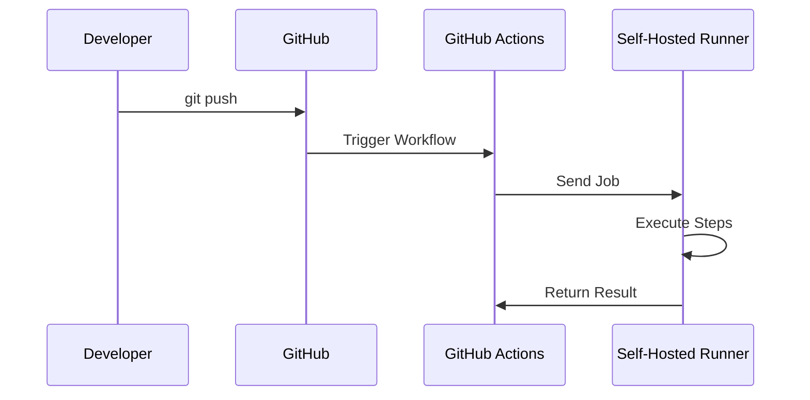

The runner is responsible for executing every command defined in the workflow.

---

# Lab Environment

The following environment was used during this laboratory.

| Component | Value |
|------------|------|
| Operating System | Windows 11 |
| Linux Environment | WSL Ubuntu |
| Repository | argocd_test |
| Runner Type | Self-Hosted |
| CI Platform | GitHub Actions |

---

# Creating the Repository

A GitHub repository was created.

```
argocd_test
```

This repository contains both:

- the GitHub Actions workflow
- the Kubernetes manifests

---

# Creating the Workflow

GitHub Actions automatically detects workflow files stored in:

```
.github/workflows/
```

Example:

```
.github/workflows/test.yml
```

Example workflow:

```yaml
name: Self Hosted Runner Demo

on:
  push:

jobs:

  demo:

    runs-on: self-hosted

    steps:

      - uses: actions/checkout@v4

      - name: Display Message

        run: echo "Hello from my Self-Hosted Runner"
```

---

# Understanding the Workflow

Let's examine each section.

## Trigger

```yaml
on:
  push:
```

The workflow starts every time code is pushed to the repository.

---

## Job

```yaml
jobs:
```

A workflow may contain one or multiple jobs.

Each job executes independently.

---

## Runner Selection

```yaml
runs-on: self-hosted
```

This is the most important instruction.

Instead of requesting a GitHub-hosted virtual machine, GitHub searches for an available Self-Hosted Runner registered with the repository.

---

## Steps

Each job executes its steps sequentially.

Example:

```yaml
steps:

- uses: actions/checkout@v4

- run: echo "Hello"
```

---

# Registering a Self-Hosted Runner

Navigate to

```
Repository

↓

Settings

↓

Actions

↓

Runners

↓

New Self-Hosted Runner
```

GitHub provides installation commands specific to your operating system.

Typical installation process:

Download the runner package

↓

Extract the archive

↓

Configure the runner

↓

Register it with GitHub

↓

Start the runner

---

# Runner Registration

During configuration, GitHub associates the runner with the repository.

After successful registration, the repository displays:

```
Idle
```

This means:

- the runner is online
- ready to receive jobs
- waiting for GitHub

---

# Executing the Workflow

Commit and push changes.

```bash
git add .

git commit -m "Test Self Hosted Runner"

git push
```

GitHub detects the push event.

The workflow is created.

GitHub assigns the job to the registered runner.

The runner downloads the repository and executes every workflow step.

---

# Internal Workflow

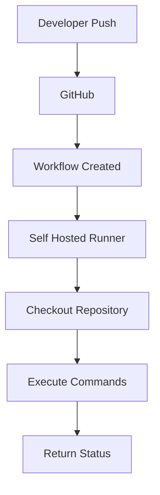

---

# Where Are Commands Executed?

Every command runs directly on the server hosting the runner.

Example:

```yaml
run: docker build .
```

Docker must already be installed on the server.

Likewise:

```yaml
run: kubectl apply -f deployment.yaml
```

requires kubectl to be installed.

The server is responsible for providing every dependency required by the workflow.

---

# Advantages

Traditional Self-Hosted Runners provide:

- Complete control over the execution environment.
- Ability to install custom software.
- Access to private infrastructure.
- Lower execution cost compared to GitHub-hosted runners for frequent workloads.
- Simple setup.

---

# Limitations

Traditional runners also have several limitations.

## Fixed Infrastructure

The runner permanently occupies the server.

Even when no workflow is running, the runner process remains active.

---

## Shared Environment

All workflows execute on the same machine.

Files, caches and software installations may be shared between workflows.

---

## Dependency Management

Every required tool must be installed manually.

Typical examples include:

- Docker
- kubectl
- Helm
- Terraform
- AWS CLI
- Azure CLI

Maintaining these tools becomes increasingly difficult over time.

---

## Limited Scalability

Suppose ten developers push code simultaneously.

GitHub creates ten workflow jobs.

A single runner can only execute one job at a time.

Additional jobs must wait until resources become available.

---

# Summary

Traditional Self-Hosted Runners are an excellent solution for:

- small teams
- home labs
- testing
- simple CI/CD pipelines

However, they become difficult to manage as the number of workflows increases.

This limitation motivates the use of Kubernetes and Actions Runner Controller, which dynamically create isolated runner Pods on demand.
# Part 2 – Running GitHub Actions on Kubernetes

## Why Kubernetes?

As the number of CI/CD pipelines grows, a single Self-Hosted Runner quickly becomes a bottleneck.

Consider the following scenario:

- 20 developers push code simultaneously.
- GitHub creates 20 workflow jobs.
- A traditional runner can execute only one job at a time (or a limited number depending on its configuration).

This results in queued jobs, longer execution times, and inefficient resource utilization.

Kubernetes solves this problem by dynamically creating isolated runners for each workflow.

Instead of relying on a permanent runner installed on a server, GitHub workflows are executed inside temporary Kubernetes Pods.

Each Pod exists only for the duration of the workflow.

Once the workflow finishes, the Pod is automatically deleted.

---

# Traditional Runner vs Kubernetes

Traditional architecture

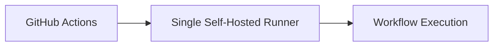

All workflows depend on a single execution environment.

---

Kubernetes architecture

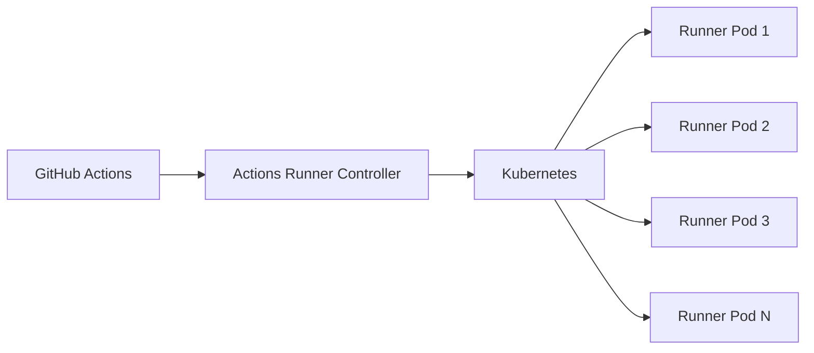

Each workflow can execute inside its own isolated Pod.

---

# Benefits of Kubernetes

Using Kubernetes provides several advantages.

## Scalability

Runner Pods are created only when workflows are waiting.

If 50 workflows are triggered simultaneously, Kubernetes can create multiple Runner Pods (depending on the available cluster resources).

---

## Better Resource Utilization

Traditional runners remain online even when no workflows are running.

With Kubernetes:

- no workflow
- no Runner Pod

Resources are consumed only when necessary.

---

## Isolation

Each workflow runs inside its own container.

This prevents conflicts between different pipelines.

For example:

Workflow A

```
Terraform 1.7
```

Workflow B

```
Terraform 1.9
```

Each workflow can execute in a different container without affecting the other.

---

## Fault Tolerance

If a Runner Pod crashes,

Kubernetes automatically creates a replacement.

No manual intervention is required.

---

## Easier Maintenance

Instead of maintaining software directly on the server,

the required tools are packaged inside a Docker image.

Example:

```Dockerfile
FROM summerwind/actions-runner:latest

RUN apt-get update && apt-get install -y \
    docker.io \
    kubectl \
    helm \
    terraform
```

Every new Runner Pod starts with exactly the same environment.

---

# Kubernetes Components Used

The laboratory relies on several Kubernetes components.

| Component | Purpose |
|------------|----------|
| Docker | Container runtime |
| Minikube | Local Kubernetes cluster |
| kubectl | Kubernetes CLI |
| Helm | Kubernetes package manager |
| cert-manager | Generates certificates required by ARC |
| ARC | Creates and manages GitHub runners |
| RunnerDeployment | Defines GitHub runners |

---

# Installing Docker

Docker is required because Minikube uses containers to run the Kubernetes control plane.

Verify Docker installation.

```bash
docker version

docker ps
```

---

# Installing Minikube

Minikube creates a local single-node Kubernetes cluster suitable for development and testing.

Start the cluster.

```bash
minikube start
```

Verify the installation.

```bash
kubectl get nodes
```

Expected output

```text
NAME        STATUS    ROLES           VERSION

minikube    Ready     control-plane   v1.xx.x
```

The Kubernetes cluster is now operational.

---

# Installing kubectl

kubectl is the command-line client used to communicate with Kubernetes.

Verify installation.

```bash
kubectl version --client
```

Example commands

```bash
kubectl get pods

kubectl get deployments

kubectl describe pod <pod-name>

kubectl logs <pod-name>
```

---

# Installing Helm

Helm is the package manager for Kubernetes.

Instead of manually creating dozens of Kubernetes manifests,

Helm installs complete applications using reusable charts.

Verify installation.

```bash
helm version
```

---

# Installing cert-manager

Actions Runner Controller requires TLS certificates.

Rather than generating certificates manually,

cert-manager automatically creates and renews them.

Install cert-manager.

```bash
kubectl apply -f https://github.com/cert-manager/cert-manager/releases/latest/download/cert-manager.yaml
```

Wait until all Pods become ready.

```bash
kubectl get pods -n cert-manager
```

Expected result

```text
cert-manager                     Running

cert-manager-cainjector          Running

cert-manager-webhook             Running
```

At this point, the Kubernetes cluster is fully prepared for installing Actions Runner Controller.
# Part 3 – Actions Runner Controller (ARC)

## What is Actions Runner Controller?

Actions Runner Controller (ARC) is a Kubernetes Operator that automates the lifecycle of GitHub Self-Hosted Runners.

Instead of manually installing and maintaining runners on a server, ARC dynamically creates, registers, and removes GitHub runners as Kubernetes Pods.

In other words, ARC acts as the bridge between GitHub Actions and Kubernetes.

---

# Why Do We Need ARC?

Without ARC, Kubernetes has no knowledge of GitHub Actions.

Likewise, GitHub Actions has no knowledge of Kubernetes.

ARC connects both systems.

It continuously monitors GitHub for pending workflow jobs and instructs Kubernetes to create runners whenever they are required.

---

# ARC Architecture


---

# What is a Kubernetes Operator?

An Operator extends Kubernetes by introducing new resources and automating operational tasks.

Instead of manually creating Pods, Deployments, ReplicaSets, Services, and Secrets, the Operator performs these actions automatically.

Examples of Kubernetes Operators include:

| Operator | Purpose |
|----------|---------|
| Actions Runner Controller | GitHub Actions runners |
| ArgoCD | GitOps deployments |
| Prometheus Operator | Monitoring |
| MongoDB Operator | Database management |

ARC is simply another Kubernetes Operator specialized in GitHub runners.

---

# Installing Actions Runner Controller

ARC is distributed as a Helm Chart.

Install it using Helm.

```bash
helm repo add actions-runner-controller https://actions-runner-controller.github.io/actions-runner-controller

helm repo update

kubectl create namespace arc-system

helm install arc \
actions-runner-controller/actions-runner-controller \
--namespace arc-system
```

Verify the installation.

```bash
kubectl get pods -n arc-system
```

Expected output

```text
arc-actions-runner-controller
```

The controller is now running inside the Kubernetes cluster.

---

# Authenticating with GitHub

ARC must authenticate with GitHub before creating runners.

During this project, a GitHub Personal Access Token (PAT) was used.

The token was stored as a Kubernetes Secret.

```bash
kubectl create secret generic controller-manager \
-n arc-system \
--from-literal=github_token=<YOUR_TOKEN>
```

Verify the Secret.

```bash
kubectl get secrets -n arc-system
```

Expected output

```text
controller-manager
```

From this point onward, ARC can communicate securely with the GitHub API.

---

# Creating a RunnerDeployment

The next step is defining how runners should be created.

This is accomplished through a Kubernetes Custom Resource named **RunnerDeployment**.

Create a file named:

```text
runner.yaml
```

Example:

```yaml
apiVersion: actions.summerwind.dev/v1alpha1

kind: RunnerDeployment

metadata:
  name: github-runner

spec:
  replicas: 1

  template:

    spec:

      repository: tahaelidrissi/argocd_test
```

---

# Understanding the Manifest

## apiVersion

```yaml
apiVersion: actions.summerwind.dev/v1alpha1
```

This API is provided by Actions Runner Controller.

It is **not** a native Kubernetes resource.

Installing ARC adds this new API to Kubernetes.

---

## Kind

```yaml
kind: RunnerDeployment
```

A RunnerDeployment is conceptually similar to a Deployment.

However, instead of managing application Pods, it manages GitHub runners.

---

## Replicas

```yaml
replicas: 1
```

This tells ARC to maintain one available runner.

If the runner disappears, ARC automatically creates another one.

---

## Repository

```yaml
repository: tahaelidrissi/argocd_test
```

This associates the runner with a specific GitHub repository.

Only workflows from this repository can use the runner.

---

# Deploying the Runner

Deploy the manifest.

```bash
kubectl apply -f runner.yaml
```

Verify the deployment.

```bash
kubectl get runnerdeployments
```

Expected output

```text
github-runner
```

ARC immediately detects the new RunnerDeployment.

---

# What Happens Internally?

The following operations occur automatically.

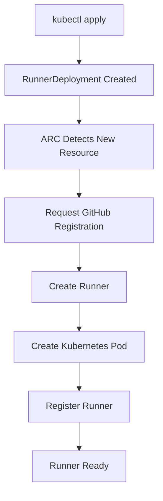

Notice that no Pod was created manually.

ARC performs every step automatically.

---

# Verifying the Runner

List all Pods.

```bash
kubectl get pods
```

Example

```text
github-runner-xxxxx
```

Inside GitHub,

navigate to

```
Repository

↓

Settings

↓

Actions

↓

Runners
```

The runner should appear as

```text
Idle
```

meaning it is registered and waiting for jobs.

---

# Key Difference Between a Traditional Runner and ARC

Traditional Runner

```text
GitHub

↓

Runner Installed on Server

↓

Workflow Execution
```

ARC

```text
GitHub

↓

Actions Runner Controller

↓

Runner Pod

↓

Workflow Execution

↓

Runner Removed
```

The server no longer executes workflows directly.

Instead, Kubernetes creates temporary runner Pods whenever they are required.

This provides better isolation, improved scalability, and more efficient resource utilization.
# Part 4 – End-to-End Workflow Execution

At this stage, the Kubernetes cluster is configured, ARC is running, and a `RunnerDeployment` has been created.

The final step is to execute a GitHub Actions workflow and observe how Kubernetes automatically provisions a runner.

---

# Triggering a Workflow

A workflow is triggered by pushing code to the GitHub repository.

```bash
git add .

git commit -m "Test ARC"

git push
```

GitHub detects the push event and creates a workflow job.

At this point, no workflow is executing yet because GitHub is waiting for an available runner.

---

# Workflow Execution Lifecycle

The following diagram illustrates the complete execution process.

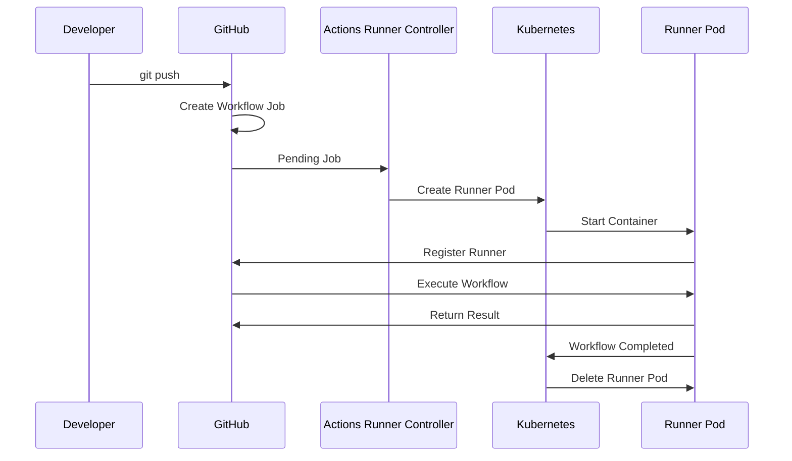

The entire process is automatic.

No manual Pod creation is required.

---

# Observing the Runner Pod

Monitor the Pods in real time.

```bash
kubectl get pods -w
```

Example output

```text
NAME                          READY   STATUS

github-runner-x7ab1           Pending

github-runner-x7ab1           ContainerCreating

github-runner-x7ab1           Running

github-runner-x7ab1           Completed

github-runner-x7ab1           Terminating
```

Each state represents a different stage of the runner lifecycle.

---

# Pod Lifecycle

The Runner Pod goes through several phases.

## Pending

Kubernetes has accepted the Pod but has not yet scheduled it.

---

## ContainerCreating

The container image is being downloaded and started.

---

## Running

The runner is connected to GitHub and executing the workflow.

---

## Completed

The workflow has finished successfully.

---

## Terminating

The Pod is being removed because it is no longer required.

---

# Automatic Runner Recreation

After the temporary runner finishes,

ARC automatically creates another runner to satisfy the desired state defined by the `RunnerDeployment`.

Example:

```text
Runner Pod A

↓

Workflow Finished

↓

Runner Pod Deleted

↓

Runner Pod B Created

↓

Waiting for Next Job
```

The runner infrastructure is therefore always ready to receive new workflows.

---

# Scaling

One of the biggest advantages of Kubernetes is scalability.

Suppose five developers push code simultaneously.

```
Developer A

Developer B

Developer C

Developer D

Developer E
```

GitHub immediately creates five workflow jobs.

ARC detects all pending jobs.

Kubernetes creates multiple Runner Pods.

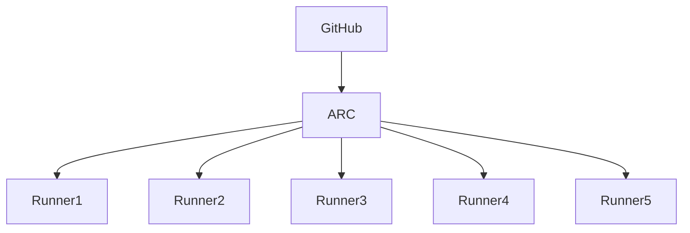

Each workflow executes independently.

Unlike a traditional runner, jobs do not need to wait for a single machine to become available.

---

# Can Kubernetes Create Unlimited Pods?

No.

The number of Runner Pods depends on the available cluster resources.

For example, if the cluster has enough CPU and memory,

Kubernetes can create many runners simultaneously.

If resources become exhausted,

new jobs remain pending until resources are available again.

Therefore,

ARC automates runner creation,

while Kubernetes decides whether sufficient resources exist to schedule new Pods.

---

# Resource Allocation

Each Runner Pod consumes resources.

Typical resources include:

- CPU
- Memory
- Storage
- Network bandwidth

Kubernetes schedules Pods according to the available resources on each node.

Example

```text
Node

├── Runner Pod 1

├── Runner Pod 2

├── Runner Pod 3

└── Runner Pod 4
```

If another node exists,

Kubernetes may distribute Pods across multiple nodes.

---

# Runner Isolation

Every workflow executes inside its own Runner Pod.

Example

```text
Workflow A

↓

Runner Pod A
```

```
Workflow B

↓

Runner Pod B
```

```
Workflow C

↓

Runner Pod C
```

Each runner has its own isolated environment.

This prevents dependency conflicts between workflows.

---

# Installing Dependencies

One common question is whether dependencies must be installed every time a new Runner Pod is created.

The answer depends on the runner image.

If the Docker image already contains the required tools,

the Pod starts immediately.

Example

```Dockerfile
FROM summerwind/actions-runner:latest

RUN apt-get update && apt-get install -y \
    docker.io \
    kubectl \
    helm \
    terraform
```

Every new Runner Pod automatically includes these tools.

If additional software is installed directly inside the workflow,

it must be installed every time a new Pod starts.

For production environments, creating a custom runner image with all required dependencies is considered a best practice.

---

# Traditional Runner vs ARC Execution

Traditional Runner

```text
Workflow

↓

Permanent Runner

↓

Execute

↓

Runner Remains Running
```

ARC

```text
Workflow

↓

Create Runner Pod

↓

Execute Workflow

↓

Delete Runner Pod

↓

Create Fresh Runner
```

The Kubernetes approach provides a clean execution environment for every workflow.

---

# Summary

During this laboratory, GitHub Actions no longer executed workflows directly on a server.

Instead:

- GitHub created workflow jobs.
- Actions Runner Controller detected pending jobs.
- Kubernetes created temporary Runner Pods.
- Each Pod executed one workflow.
- Completed Pods were automatically removed.
- ARC ensured that runners remained available for future jobs.

This architecture enables dynamic scaling, better resource utilization, and isolated execution environments, making it suitable for modern cloud-native CI/CD platforms.
# Architecture Comparison

The following table summarizes the main differences between a traditional Self-Hosted Runner and a Kubernetes-based runner managed by Actions Runner Controller.

| Feature | Traditional Self-Hosted Runner | Kubernetes + ARC |
|----------|-------------------------------|------------------|
| Runner Type | Permanent | Ephemeral |
| Installation | Manual | Automatic |
| Execution Environment | Shared | Isolated |
| Scalability | Limited | Dynamic |
| Resource Utilization | Static | On Demand |
| Maintenance | Manual | Automated |
| Dependency Management | Installed on the Server | Docker Runner Image |
| Fault Tolerance | Low | High |
| Multi-node Support | No | Yes |
| Production Ready | Small Projects | Enterprise Scale |

---

# Traditional Runner Workflow

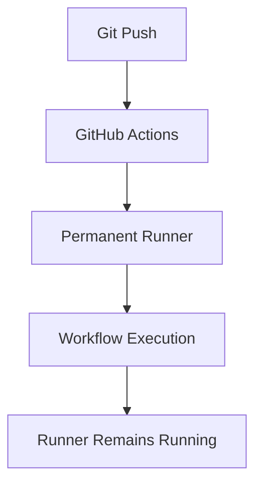

---

# Kubernetes + ARC Workflow

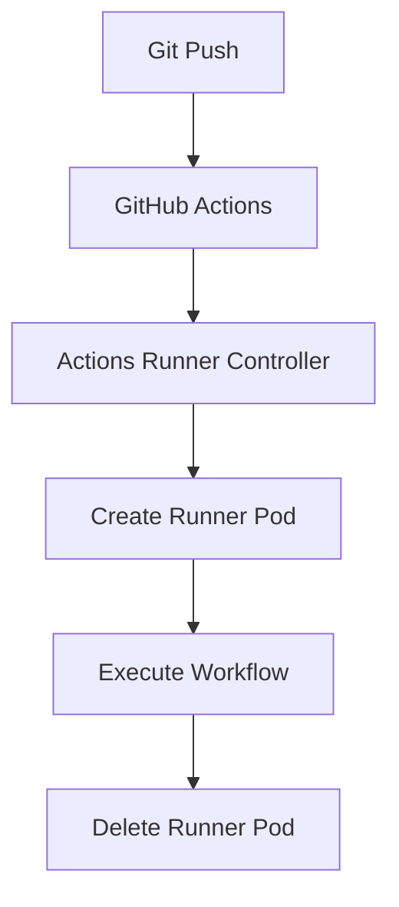

---

# Troubleshooting

During the implementation of this project, several issues were encountered.

## Minikube Certificate Error

Problem

```
certificate signed by unknown authority
```

Cause

Old Kubernetes certificates remained on the local machine after a previous Minikube installation.

Solution

```bash
minikube delete --all --purge

rm -rf ~/.minikube

rm -rf ~/.kube

minikube start
```

---

## Missing cert-manager

Problem

```
no matches for kind "Certificate"
```

Cause

ARC depends on cert-manager for certificate generation.

Solution

Install cert-manager before installing Actions Runner Controller.

Verify

```bash
kubectl get pods -n cert-manager
```

All Pods must be in the **Running** state.

---

## Missing GitHub Secret

Problem

```
secret "controller-manager" not found
```

Cause

The GitHub Personal Access Token had not been stored as a Kubernetes Secret.

Solution

```bash
kubectl create secret generic controller-manager \
-n arc-system \
--from-literal=github_token=<YOUR_TOKEN>
```

---

## Runner Pod Stuck in ContainerCreating

Diagnostic

```bash
kubectl describe pod <pod-name>
```

Possible causes

- Missing Secret
- Missing cert-manager
- Image Pull failure
- Insufficient resources

---

## Useful Debugging Commands

List Pods

```bash
kubectl get pods
```

Watch Pods

```bash
kubectl get pods -w
```

Describe a Pod

```bash
kubectl describe pod <pod-name>
```

View Logs

```bash
kubectl logs <pod-name>
```

Check Deployments

```bash
kubectl get deployments
```

Check RunnerDeployment

```bash
kubectl get runnerdeployments
```

---

# Best Practices

When using Self-Hosted Runners in production, the following recommendations should be followed.

## Use GitHub Apps

GitHub recommends using GitHub Apps instead of Personal Access Tokens for authentication.

---

## Build a Custom Runner Image

Instead of installing dependencies during every workflow execution, build a Docker image containing all required tools.

Example

- Docker
- kubectl
- Helm
- Terraform
- AWS CLI
- Azure CLI

This significantly reduces workflow execution time.

---

## Configure Resource Requests and Limits

Each Runner Pod should define CPU and memory requests and limits.

Example

```yaml
resources:

  requests:

    cpu: "1"

    memory: "2Gi"

  limits:

    cpu: "2"

    memory: "4Gi"
```

This prevents one workflow from consuming all cluster resources.

---

## Enable Autoscaling

For production environments, Kubernetes should automatically add or remove worker nodes according to demand.

Possible solutions include

- Cluster Autoscaler
- Karpenter

---

## Monitor the Cluster

Monitoring tools such as Prometheus and Grafana should be used to observe

- CPU usage
- Memory usage
- Running Pods
- Failed Jobs
- Node utilization

---

## Store Kubernetes Manifests in Git

All Kubernetes manifests should be version controlled.

Typical files include

```
runner.yaml

deployment.yaml

service.yaml

ingress.yaml
```

---

# Lessons Learned

During this project, several important DevOps concepts were explored.

Key learnings include

- Understanding how GitHub Actions executes workflows.
- Configuring a traditional Self-Hosted Runner.
- Creating a local Kubernetes cluster using Minikube.
- Installing applications on Kubernetes with Helm.
- Understanding the purpose of cert-manager.
- Deploying Actions Runner Controller.
- Creating Kubernetes Secrets.
- Deploying a RunnerDeployment.
- Executing GitHub workflows inside Kubernetes Pods.
- Understanding the lifecycle of ephemeral runners.
- Learning how Kubernetes dynamically scales CI/CD workloads.

This project also demonstrated how Kubernetes improves workflow isolation, scalability, and resource utilization compared to traditional Self-Hosted Runners.

---

# Future Improvements

Possible improvements include

- Migrate from RunnerDeployment to GitHub Runner Scale Sets.
- Build a custom Runner Docker image.
- Deploy ARC on a multi-node Kubernetes cluster.
- Integrate Argo CD for GitOps deployments.
- Enable Cluster Autoscaler.
- Configure Horizontal Pod Autoscaler (HPA).
- Add monitoring with Prometheus and Grafana.
- Store secrets securely using External Secrets or HashiCorp Vault.

---

# Technologies Used

| Category | Technology |
|-----------|------------|
| Source Control | Git |
| CI/CD | GitHub Actions |
| Runner | Self-Hosted Runner |
| Container Runtime | Docker |
| Container Orchestration | Kubernetes |
| Local Kubernetes | Minikube |
| Kubernetes CLI | kubectl |
| Package Manager | Helm |
| Runner Management | Actions Runner Controller (ARC) |
| Certificates | cert-manager |
| Configuration | YAML |
| Operating System | Ubuntu (WSL) |
| Host OS | Windows 11 |

---

# Conclusion

This project explored two approaches for executing GitHub Actions workflows.

The first approach relied on a traditional Self-Hosted Runner installed directly on a server. While simple to configure, this solution offers limited scalability and requires manual maintenance of both the execution environment and installed dependencies.

The second approach integrated GitHub Actions with Kubernetes using Actions Runner Controller (ARC). In this architecture, workflows are executed inside ephemeral Kubernetes Pods that are automatically created, registered, and removed as needed.

Compared to a traditional runner, ARC provides better workload isolation, dynamic scaling, improved resource utilization, and a cloud-native execution model.

Overall, this project demonstrates how Kubernetes can transform GitHub Actions into a scalable and production-ready CI/CD platform capable of handling concurrent workloads efficiently.